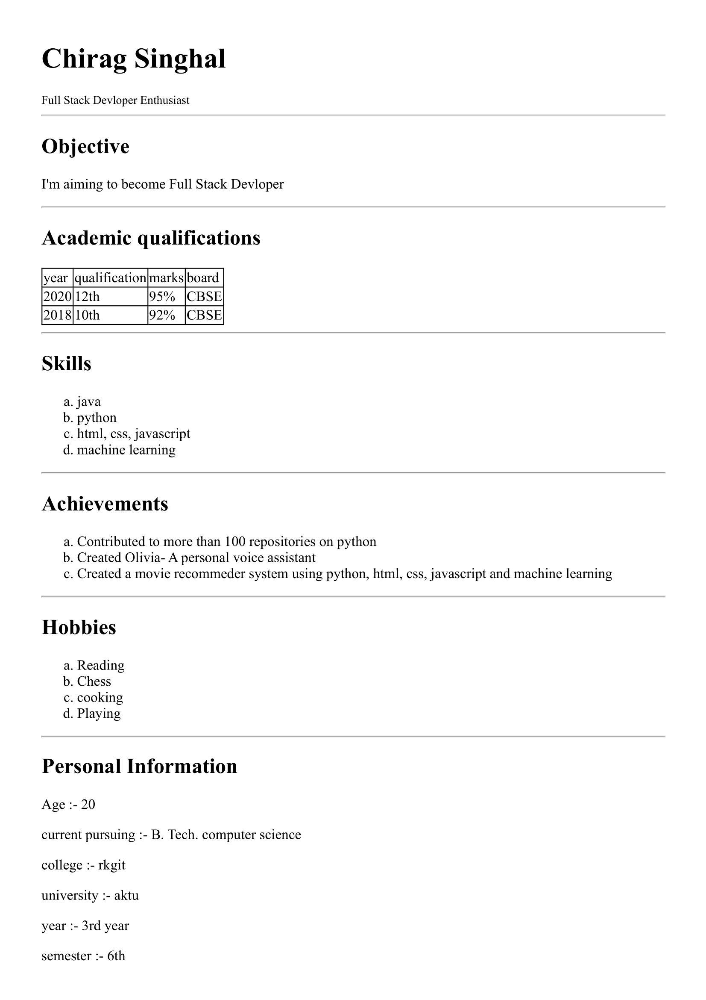

# Experiment 1

## Aim

Write HTML/Java scripts to display your CV in navigator, your Institute website, Department Website and Tutorial
website for specific subject.

## Code

```
<!DOCTYPE html>
<html>

<head>
    <title>Aim: Write HTML/Java scripts to display your CV</title>
    <style>
        table {
            border-collapse: collapse;
            border-color: black
        }

        body {
            background-color: lightyellow
        }

        ol {
            list-style-type: lower-alpha
        }
    </style>
</head>

<body>
    <h1>Chirag Singhal</h1><sub>Full Stack Devloper Enthusiast</sub>
    <hr>
    <h2>Objective</h2>
    <p>I'm aiming to become Full Stack Devloper</p>
    <hr>
    <h2>Academic qualifications</h2>
    <table border="1">
        <thead>
            <tr>
                <td>year</td>
                <td>qualification</td>
                <td>marks</td>
                <td>board</td>
            </tr>
        </thead>
        <tr>
            <td>2020</td>
            <td>12th</td>
            <td>95%</td>
            <td>CBSE</td>
        </tr>
        <tr>
            <td>2018</td>
            <td>10th</td>
            <td>92%</td>
            <td>CBSE</td>
        </tr>
    </table>
    <hr>
    <h2>Skills</h2>
    <ol>
        <li>java</li>
        <li>python</li>
        <li>html, css, javascript</li>
        <li>machine learning</li>
    </ol>
    <hr>
    <h2>Achievements</h2>
    <ol>
        <li>Contributed to more than 100 repositories on python</li>
        <li>Created Olivia- A personal voice assistant</li>
        <li>Created a movie recommeder system using python, html, css, javascript and machine learning</li>
    </ol>
    <hr>
    <h2>Hobbies</h2>
    <ol>
        <li>Reading</li>
        <li>Chess</li>
        <li>cooking</li>
        <li>Playing</li>
    </ol>
    <hr>
    <h2>Personal Information</h2>
    <p>Age :- 20</p>
    <p>current pursuing :- B. Tech. computer science</p>
    <p>college :- rkgit</p>
    <p>university :- aktu</p>
    <p>year :- 3rd year</p>
    <p>semester :- 6th</p>
</body>

</html>
```

## Output


