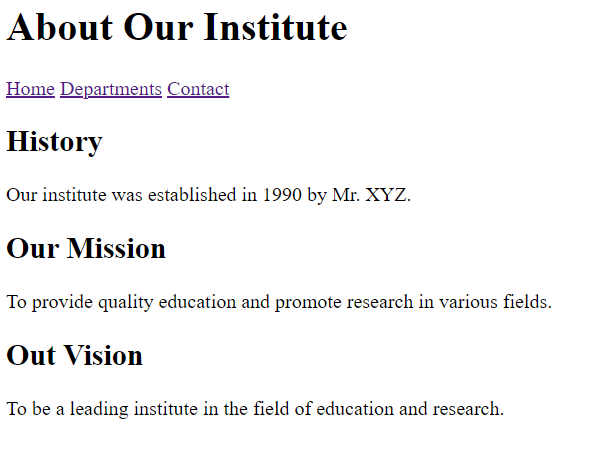

# WT Experiment: 4

## Aim

Write an HTML code to create your Institute website, courses available Website.

## Code

### index.html

```html
<!DOCTYPE html>
<html lang="en">
<head>
  <title>Institute Website</title>
</head>
<body>
    <h1>Welcome to Our Institute</h1>
      <a href="about.html">About</a>
      <a href="departments.html">Departments</a>
      <a href="contact.html">Contact</a>
      <h2>Featured Courses</h2>
      <ul>
        <li>Computer Science</li>
        <li>Electronics and Communication</li>
        <li>Mechanical Engineering</li>
        <li>Civil Engineering</li>
      </ul>
</body>
</html>
```

### about.html

```html
<!DOCTYPE html>
<html lang="en">
<head>
    <title>About | Institute Website</title>
</head>
<body>
    <h1>About Our Institute</h1>
    <a href="index.html">Home</a>
    <a href="departments.html">Departments</a>
    <a href="contact.html">Contact</a>
    <h2>History</h2>
    <p>Our institute was established in 1990 by Mr. XYZ.</p>
    <h2>Our Mission</h2>
    <p>To provide quality education and promote research in various fields.</p>
    <h2>Out Vision</h2>
    <p>To be a leading institute in the field of education and research.</p>
</body>
</html>
```

### contact.html

```html
<!DOCTYPE html>
<html lang="en">
<head>
  <title>Contact | Institute Website</title>
</head>
<body>
    <h1>Contact Us</h1>
      <a href="index.html">Home</a>
      <a href="about.html">About</a>
      <a href="departments.html">Departments</a>
      <h2>Address</h2>
      <p>123 Institute Street, City, Country</p>
        <h2>Phone</h2>
        <p>123-456-7890</p>
        <h2>Email</h2>
        <p> 1234@insta.com</p>

</body>
</html>

```

### departments.html

```html
<!DOCTYPE html>
<html lang="en">

<head>
    <title>Departments | Institute Website</title>
</head>

<body>
    <h1>Departments</h1>
    <a href="index.html">Home</a>
    <a href="about.html">About</a>
    <a href="contact.html">Contact</a>
    <h2>List of Departments</h2>
    <ul>
        <li>Computer Science
            <ul> Computer Science is a branch of engineering that deals with the study of computers and their
                applications.
                It is a field that combines both computer engineering and computer science. Computer science is a branch
                of engineering that deals with the study of computers and their applications. It is a field that combines
                both computer engineering and computer science.
                Some of the subjects taught in this department are:
                <li>Data Structure</li>
                <li>Web Technology</li>
                <li>Software Engineering</li>
            </ul>
        </li>
        <li>Electronics and Communication
            <ul>
                Electronics and Communication Engineering is a branch of engineering that deals with the study of
                electronics and communication. It is a field that combines both electronics engineering and
                communication engineering.
                Some of the subjects taught in this department are:
                <li>Microprocessor</li>
                <li>Communication System</li>
                <li>Electronics</li>
            </ul>
        </li>
        <li>Mechanical Engineering
            <ul>
                Mechanical Engineering is a branch of engineering that deals with the study of mechanical systems.
                It is a field that combines both mechanical engineering and mechanical engineering.
                Some of the subjects taught in this department are:
                <li>Thermodynamics</li>
                <li>Fluid Mechanics</li>
                <li>Machine Design</li>
            </ul>
        <li>Civil Engineering</li>
        <ul>
            Civil Engineering is a branch of engineering that deals with the study of civil systems.
            It is a field that combines both civil engineering and civil engineering.
            Some of the subjects taught in this department are:
            <li>Structural Analysis</li>
            <li>Fluid Mechanics</li>
            <li>Machine Design</li>
        </ul>
</body>
</html>
```

## Outputs

### Home Page (index.html)


### About Page (about.html)



### Contact Page (contact.html)


### Departments Page (departments.html)

